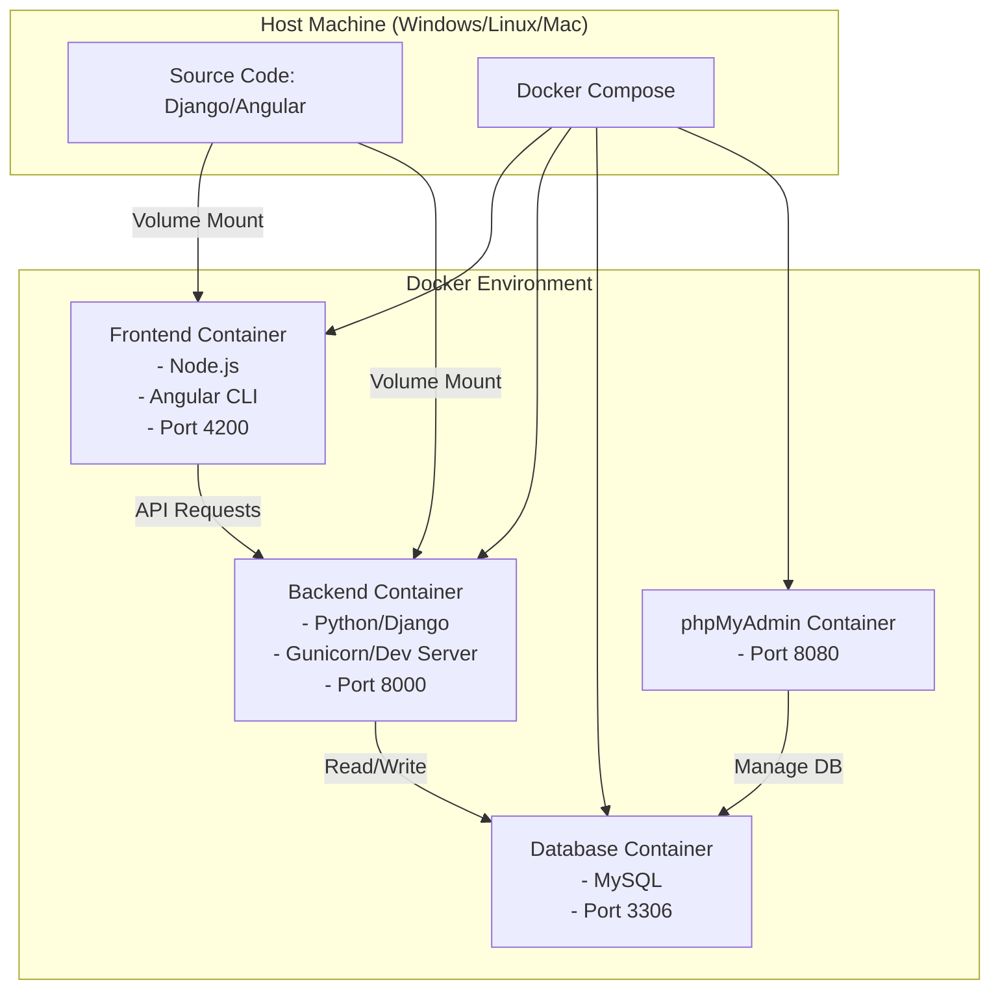

# 構成案と実装計画

## 概要
Django（バックエンド）とAngular（フロントエンド）を利用した開発環境をDocker Composeを用いて構築する。
Windows環境の他の開発者へ容易に配布可能な構成とし、ソースコードと実行環境を明確に分離する。ローカルのソースコードをコンテナにマウントすることで、編集内容が即座に反映されるホットリロード環境を実現する。

## 構成図

## アーキテクチャのポイント
- **フロントエンド**: `node` ベースのイメージ。ローカルのAngularコードを `/app` にマウントし、`ng serve --host 0.0.0.0` で起動。
- **バックエンド**: `python` ベースのイメージ。ローカルのDjangoコードを `/app` にマウントし、`python manage.py runserver 0.0.0.0:8000` で起動。
- **データベース**: `mysql` の公式イメージを使用。データは名前付きボリュームに保存し、永続化。
- **DB管理ツール**: `phpmyadmin` の公式イメージを使用し、ブラウザからMySQLへアクセス可能にする。

## ファイル変更予定
### Docker & Config Files
#### [NEW] docker-compose.yml
全体のオーケストレーションを定義。
#### [NEW] backend/Dockerfile
Django用の環境構築手順。
#### [NEW] backend/requirements.txt
Django、MySQLクライント（mysqlclient等）などのPython依存関係。
#### [NEW] frontend/Dockerfile
Angular用の環境構築手順。

### 配布用スクリプト
#### [NEW] setup.bat (Windows用)
開発者が簡単に初期セットアップを行えるようにするバッチファイル。
#### [NEW] setup.sh (Mac/Linux用)
開発者が簡単に初期セットアップを行えるシェルスクリプト。

## 手順
1. 各ディレクトリ (`backend`, `frontend`) を作成。
2. Dockerfileと `docker-compose.yml` を配置。
3. 初期化スクリプトを用いてDjangoプロジェクトとAngularプロジェクトの雛形を生成（コンテナ内で実行しホストに同期）。
4. `setup.bat` などの配布用スクリプトを作成し構築手順書（Walkthrough）に組み込む。
